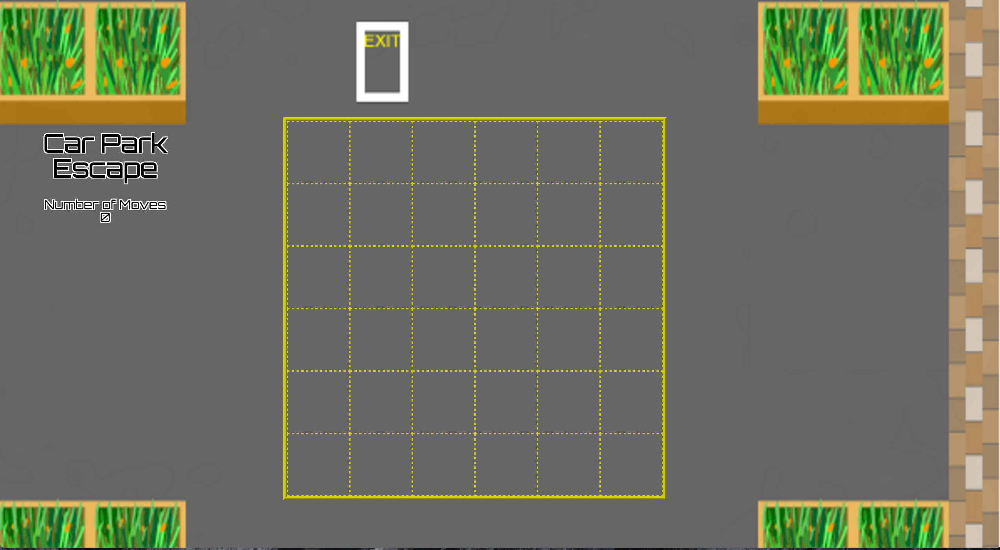

# Car Park Escape

---

  

http://peaceful-woodland-17779.herokuapp.com/

### Introduction

This is a puzzle game designed to test your ability to solve problems by navigating other cars to get through to the exit.  

The level design for my game is random, so the difficulty is entirely up to the luck of the draw.  

---

### How To Play

The game is played by clicking on the vehicle you wish to move and it will move one block in that direction.  

The aim of the game is to move the black car such that it reaches the exit.  

---

### Design And Code

The coding is all written in Javascript.  
The design is from a mix of HTML, CSS and Javascript.

---

### Credits
* Rush Hour board game by ThinkFun.
* Background image (edited by me to fit my game): http://www.parkinggames.com/parking-mania.html  
* Images for cars: http://www.lutanho.net/play/carchamp.html